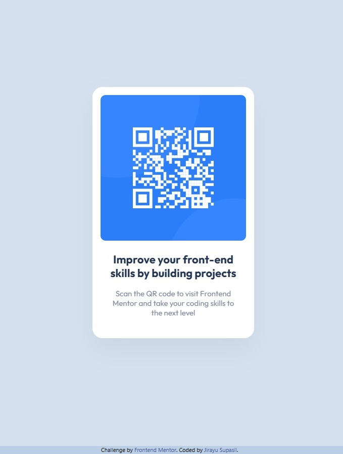

# Frontend Mentor - QR code component solution

This is a solution to the [QR code component challenge on Frontend Mentor](https://www.frontendmentor.io/challenges/qr-code-component-iux_sIO_H). Frontend Mentor challenges help you improve your coding skills by building realistic projects.

## Table of contents

- [Overview](#overview)
  - [Screenshot](#screenshot)
  - [Links](#links)
- [My process](#my-process)
  - [Built with](#built-with)
  - [What I learned](#what-i-learned)
  - [Continued development](#continued-development)
  - [Useful resources](#useful-resources)
- [Author](#author)
- [Acknowledgments](#acknowledgments)

## Overview

### Screenshot

### Links

- Solution URL: [GitHub](https://github.com/jsupasil/frontend-mentor-newbie-qr-code-component)
- Live Site URL: [Vercel](https://frontend-mentor-newbie-qr-code-component.vercel.app/)

## My process

### What I learned

### Built with

- Semantic HTML5 markup
- CSS custom properties
- Flexbox
- [Tailwind CSS](https://tailwindcss.com/) - Tailwind CSS framework

### What I learned

I learned how to design flex box and css properties using tailwind CSS framework. Flex box can also be applied for position alignments such as aligning element at center. There are some CSS properties that I have to search more and adjust to match with figma design such as drop shadow and border radious.

### Continued development

I think the qr code can be link to the website by using <a> tag.

### Useful resources

- [CSS box-shadow Property by W3 school](https://www.w3schools.com/cssref/css3_pr_box-shadow.php) - This help me understand the concept of box-shadow which is usefule to apply with shadow effect of the element in this project.

## Author

- Website - [Jirayu Supasil](https://github.com/jsupasil)
- Frontend Mentor - [@jsupasil](https://www.frontendmentor.io/profile/jsupasil)

## Acknowledgments

I acknowledge [Tech Up Software Bootscamp](https://www.techupth.com/) for training and supporting which are vastly helpful to complete this project.
